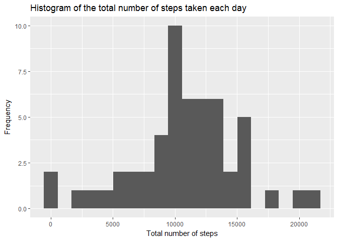
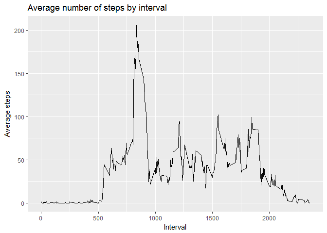
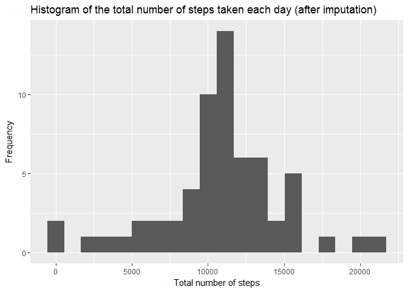
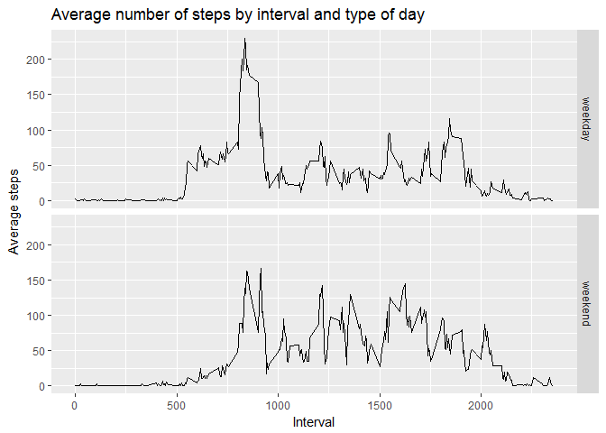

Introduction
------------

It is now possible to collect a large amount of data about personal movement using activity monitoring devices such as a Fitbit, Nike Fuelband, or Jawbone Up. These type of devices are part of the “quantified self” movement – a group of enthusiasts who take measurements about themselves regularly to improve their health, to find patterns in their behavior, or because they are tech geeks. But these data remain under-utilized both because the raw data are hard to obtain and there is a lack of statistical methods and software for processing and interpreting the data.

This assignment makes use of data from a personal activity monitoring device. This device collects data at 5 minute intervals through out the day. The data consists of two months of data from an anonymous individual collected during the months of October and November, 2012 and include the number of steps taken in 5 minute intervals each day.

The data for this assignment can be downloaded from the course web site:

Dataset: Activity monitoring data \[52K\] The variables included in this dataset are:

-   steps: Number of steps taking in a 5-minute interval (missing values are coded as NA)
-   date: The date on which the measurement was taken in YYYY-MM-DD format
-   interval: Identifier for the 5-minute interval in which measurement was taken

The dataset is stored in a comma-separated-value (CSV) file and there are a total of 17,568 observations in this dataset.

Loading data
------------

Read the CSV file.

``` r
dfActiv <- read.csv("activity.csv",stringsAsFactors = FALSE)
dfActiv$date <- as.Date(dfActiv$date)
head(dfActiv)
```

    ##   steps       date interval
    ## 1    NA 2012-10-01        0
    ## 2    NA 2012-10-01        5
    ## 3    NA 2012-10-01       10
    ## 4    NA 2012-10-01       15
    ## 5    NA 2012-10-01       20
    ## 6    NA 2012-10-01       25

Steps taken each day
--------------------

Compute total number of steps taken each day.

``` r
dfTotalSteps <- aggregate(steps~date, dfActiv, sum, na.rm = FALSE)
head(dfTotalSteps)
```

    ##         date steps
    ## 1 2012-10-02   126
    ## 2 2012-10-03 11352
    ## 3 2012-10-04 12116
    ## 4 2012-10-05 13294
    ## 5 2012-10-06 15420
    ## 6 2012-10-07 11015

Histogram of the total number of steps taken each day.

``` r
library(ggplot2)
p <- qplot(dfTotalSteps$steps, geom="histogram", bins = 20) +
    ggtitle("Histogram of the total number of steps taken each day") + 
    xlab("Total number of steps") +
    ylab("Frequency")
print(p)
```



Compute the mean and median number of steps taken each day.

``` r
print(paste("Mean of number of steps taken each day: ", mean(dfTotalSteps$steps, na.rm = FALSE)))
```

    ## [1] "Mean of number of steps taken each day:  10766.1886792453"

``` r
print(paste("Median of number of steps taken each day: ", median(dfTotalSteps$steps, na.rm = FALSE)))
```

    ## [1] "Median of number of steps taken each day:  10765"

Average daily activity pattern
------------------------------

Make a time series plot of the 5-minute interval (x-axis) and the average number of steps taken, averaged across all days (y-axis)

``` r
dfAverageSteps <- aggregate(steps~interval,dfActiv,mean)
p <- ggplot(data=dfAverageSteps, aes(x=interval, y=steps)) +
    geom_line() +
    ggtitle("Average number of steps by interval") + 
    xlab("Interval") +
    ylab("Average steps")
print(p)
```



Find 5-minute interval that, on average, contains the maximum number of average steps ...

``` r
ind.max <- which(dfAverageSteps$steps==max(dfAverageSteps$steps))
print(paste("Interval",dfAverageSteps$interval[ind.max],"(average steps =",round(dfAverageSteps$steps[ind.max],digits=2),")"))
```

    ## [1] "Interval 835 (average steps = 206.17 )"

Imputing missing values
-----------------------

Calculate and report the total number of missing values per rows in the dataset ...

``` r
ind.na.rows <- apply(is.na(dfActiv), 1, any)
print(paste("Number of rows with missing values:",sum(ind.na.rows)))
```

    ## [1] "Number of rows with missing values: 2304"

Impute missing data using the mean of the corresponding 5-minute interval ...

``` r
ind.na.rows <- which(ind.na.rows)
dfActiv.imp <- dfActiv
for (i in ind.na.rows){
    dfActiv.imp[i,"steps"] <- dfAverageSteps[dfAverageSteps$interval==dfActiv.imp[i,"interval"],"steps"]
}
```

Histogram of the total number of steps taken each day after missing values are imputed

``` r
dfTotalSteps.imp <- aggregate(steps~date, dfActiv.imp, sum)
p <- qplot(dfTotalSteps.imp$steps, geom="histogram", bins = 20) +
    ggtitle("Histogram of the total number of steps taken each day (after imputation)") + 
    xlab("Total number of steps") +
    ylab("Frequency")
print(p)
```



Activity patterns
-----------------

Are there differences in activity patterns between weekdays and weekends?

Create a new factor variable in the dataset with two levels (“weekday” and “weekend”) indicating whether a given date is a weekday or weekend day.

``` r
dfActiv.imp$day.type <- "weekday"
# Find weekend days ...
dfActiv.imp[as.POSIXlt(dfActiv.imp$date)$wday %in% c(6,0),"day.type"] <- "weekend"
```

Create a panel plot comparing the average number of steps taken per 5-minute interval across weekdays and weekends

``` r
dfAverageSteps.wd <- aggregate(steps~interval+day.type,dfActiv.imp,mean)
p <- ggplot(data=dfAverageSteps.wd, aes(x=interval, y=steps)) +
    geom_line() +
    facet_grid(day.type ~ .) +
    ggtitle("Average number of steps by interval and type of day") + 
    xlab("Interval") +
    ylab("Average steps")
print(p)
```


